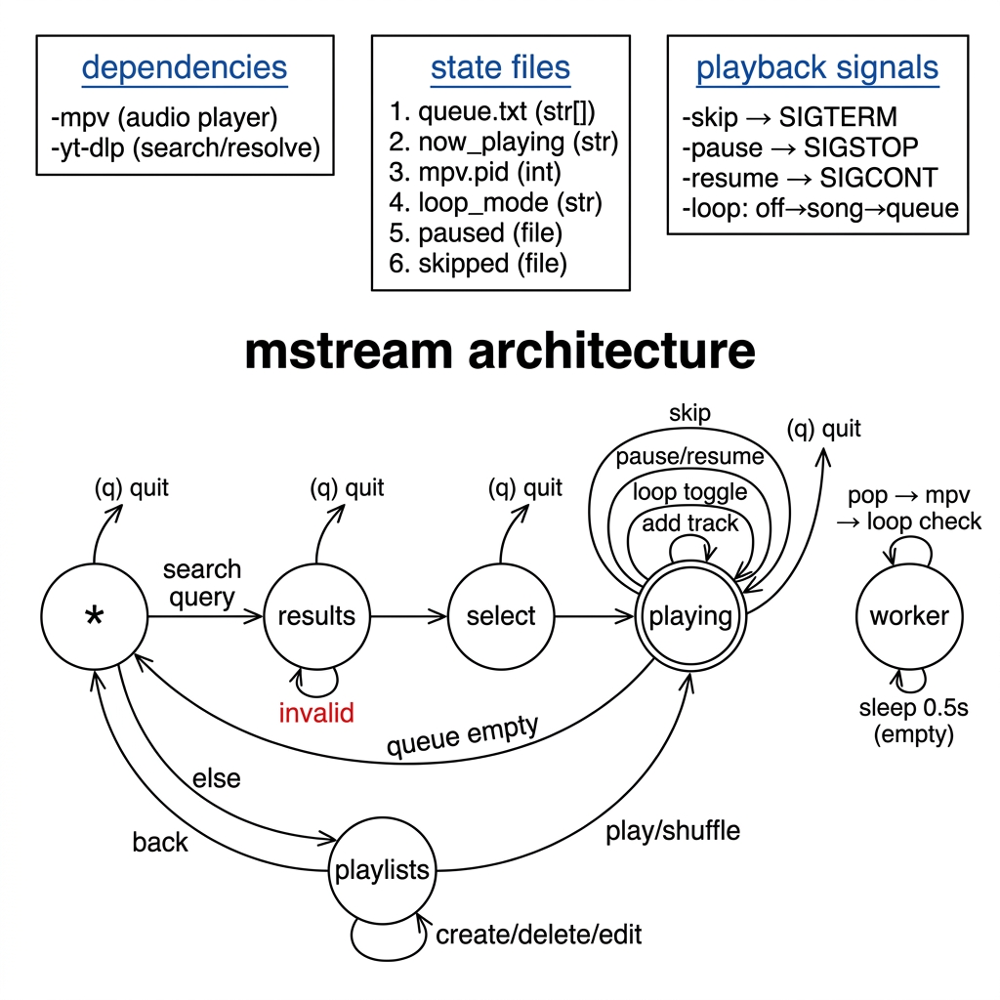

# Mstream — Architecture



---

## How It Works

Mstream is a single Bash script (`mstream.sh`) that streams audio from YouTube Music in your terminal. It runs as **two parallel processes** that talk to each other through plain text files on disk — no sockets, no pipes.

| Process | What it does |
|---------|-------------|
| **Main process** | Runs the TUI — menus, search, playlist management |
| **Background worker** | Loops forever, popping tracks from the queue and feeding them to `mpv` |

---

## Startup

When you run `./mstream.sh`, the script does this before showing you anything:

1. **Create dirs** — `mkdir -p ~/.mstream/playlists`.
2. **Lock** — Acquires a file lock (`flock`) on `~/.mstream/mstream.lock` so two instances can't run at the same time.
3. **Reset** — Clears all leftover state files from any previous session (`queue.txt`, `now_playing`, `paused`, etc.) and sets `loop_mode` to `off`.
4. **Dependency check** — Verifies `mpv` and `yt-dlp` are installed. Exits immediately if either is missing.
5. **Register cleanup trap** — Sets a `trap` on `EXIT`, `INT`, `TERM`, `HUP` so resources are always cleaned up.
6. **Spawn worker** — Starts `player_worker()` as a background process and saves its PID.

If you pass CLI arguments (e.g. `./mstream.sh believer`), mstream runs a search → select → play flow first. After playing mode ends, it falls through into the normal main menu loop.

---

## State Files

Everything lives in `~/.mstream/`. These files are the only communication channel between the main process and the worker.

| File | Type | Purpose |
|------|------|---------|
| `queue.txt` | Line-delimited text | The play queue. Each line is `videoID\|title\|artist`. The worker pops from the top; new tracks are appended to the bottom. |
| `now_playing` | Single line | Written by the worker when a track starts. Read by the TUI to display "Now Playing". |
| `mpv.pid` | Integer | PID of the currently running `mpv` process. Used by the main process to send signals (skip/pause/resume). |
| `loop_mode` | String (`off`/`song`/`queue`) | Controls what happens after a track finishes. |
| `paused` | Presence-based | If this file exists, playback is paused. Deleted on resume or skip. |
| `skipped` | Presence-based | Touched by `do_skip()` so the worker knows not to re-queue the track in `song` loop mode. |
| `mstream.lock` | Lock file | Prevents multiple instances via `flock`. |
| `playlists/*.txt` | Line-delimited text | Saved playlists, same `vid\|title\|artist` format as the queue. |

---

## The Main Menu (`*` state)

The entry point is a simple arrow-key menu with three options:

- **Search** → prompts for a song name, runs a search, lets you pick a result, queues it, and enters Playing Mode.
- **Playlists** → opens the playlist manager (create, delete, add/remove songs, play, or shuffle).
- **Quit** → triggers cleanup and exits.

---

## Search Flow (`*` → `results` → `select` → `playing`)

1. Your query is URL-encoded and sent to YouTube Music's search page via `yt-dlp`.
2. `yt-dlp` extracts up to 5 results, returning `videoID|title|artist` for each.
3. Results are displayed in an arrow-key menu. If you cancel, you go back to `*`.
4. Your selection is appended to `queue.txt`.
5. The TUI switches to **Playing Mode**.

URL-based inputs are explicitly rejected — only song name queries are allowed.

---

## Playing Mode (`playing` state)

This takes over your entire terminal (`tput smcup`) and shows a Now Playing screen. The menu's keyboard input has a 1-second timeout — when no key is pressed, a callback checks if the track, queue count, or pause state changed and redraws only the status bar if needed.

**Available actions (self-loops on the `playing` state):**

| Action | What happens |
|--------|-------------|
| **Skip** | Touches `skipped` file, sends `SIGCONT` (if paused) then `SIGTERM` to mpv. Worker picks up next track. |
| **Pause** | Sends `SIGSTOP` to mpv. Creates `paused` file. |
| **Resume** | Sends `SIGCONT` to mpv. Removes `paused` file. |
| **Loop toggle** | Cycles `loop_mode`: `off` → `song` → `queue` → `off`. |
| **Queue** | Opens a sub-menu to view, remove, reorder, or clear tracks. |
| **Add** | Search for a new song or load a playlist into the queue. |
| **Quit** | Full cleanup and exit. |

When the queue empties and mpv stops, Playing Mode auto-exits back to the Main Menu.

---

## Background Worker (`worker` state)

This is a simple infinite loop running in a background process:

```
while true:
    if queue.txt is empty:
        sleep 0.5s
        continue

    pop first line from queue.txt
    write it to now_playing
    launch: mpv --no-video --ytdl-format=bestaudio <youtube_url>
    save mpv PID to mpv.pid
    wait for mpv to exit

    clean up: remove mpv.pid, now_playing, paused

    check loop_mode:
        "song" (and not skipped) → re-insert track at FRONT of queue
        "queue"                  → append track to END of queue
        "off"                    → discard

    if mpv exited with error → sleep 1.5s (rate-limit cooldown)
```

The worker never touches the terminal. It only reads/writes state files.

---

## Playlist System (`playlists` state)

Playlists are plain `.txt` files in `~/.mstream/playlists/`, using the exact same `vid|title|artist` format as the queue.

**Operations:**

- **Create** — prompts for a name (sanitized to `A-Za-z0-9_-`), creates an empty `.txt` file.
- **Delete** — select one or more playlists by index, files are removed.
- **Add Song** — searches YouTube Music and appends the result to the playlist file.
- **Remove Song** — displays the playlist as a numbered table, lets you pick indices to remove.
- **Play** — copies all lines from the playlist file into `queue.txt`, enters Playing Mode.
- **Shuffle** — same as Play, but pipes through `shuf` first.

---

## Playback Signals

The main process controls the mpv instance (owned by the worker) via Unix signals, using the PID stored in `mpv.pid`:

| Signal | Effect |
|--------|--------|
| `SIGSTOP` | Freezes mpv (pause) |
| `SIGCONT` | Unfreezes mpv (resume) |
| `SIGTERM` | Kills mpv (skip to next track) |

---

## Loop Modes

| Mode | Behavior |
|------|----------|
| `off` | Tracks play once and are discarded |
| `song` | Current track is re-inserted at the **front** of the queue (repeats forever until skipped) |
| `queue` | Finished tracks are appended to the **end** of the queue (entire queue loops) |

---

## Cleanup

A `trap` on `EXIT`, `INT`, `TERM`, and `HUP` ensures everything is torn down:

1. Restore terminal (cursor, alternate screen buffer).
2. Kill the background worker.
3. Kill mpv (`kill -9`).
4. Kill any remaining background jobs.
5. Remove all state files.
